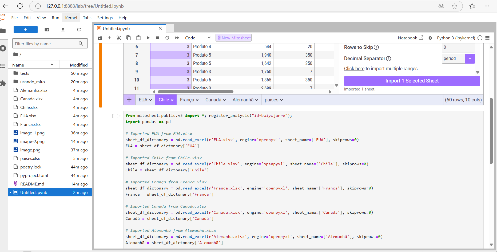

MitoSheet é uma extensão da biblioteca Mito para Python que transforma o Jupyter Notebook em uma interface de planilha interativa, tornando mais fácil e visual a manipulação de dados. MitoSheet é ideal para quem quer automatizar processos de transformação de dados sem precisar escrever cada linha de código. Com ela, você consegue realizar operações comuns em dataframes pandas usando uma interface de arrastar e soltar. Assim, você evita o trabalho repetitivo de escrever código manualmente para tarefas de análise e limpeza de dados.

# Principais Funcionalidades do MitoSheet
Manipulação Visual de Dados: Permite manipular dados em uma interface que imita uma planilha. Isso inclui ações como filtrar, ordenar, agrupar, juntar tabelas, criar colunas calculadas, entre outras.

Geração Automática de Código Python: Cada ação feita na interface MitoSheet gera automaticamente o código Python equivalente em pandas. Isso é especialmente útil para automatizar o fluxo de trabalho, pois você pode reaproveitar o código gerado para scripts e pipelines futuros.

Facilidade para Iniciantes: Para quem está aprendendo pandas ou quer realizar manipulações de dados sem muito código, o MitoSheet permite explorar as operações de forma visual e ao mesmo tempo aprender como elas funcionam em Python.

Criação Rápida de Scripts de Limpeza e Análise: O MitoSheet acelera o desenvolvimento de scripts de limpeza e análise de dados, permitindo que você gere transformações em poucos cliques, economizando tempo no processo.

Exemplo de Aplicações Práticas no Dia a Dia
Limpeza de Dados: Facilita o processo de tratar valores ausentes, remover duplicatas, e realizar outras limpezas, sem precisar codificar manualmente.
Transformações de Dados: Permite aplicar cálculos e criar colunas derivadas, como totais e médias, de forma visual.
Análises Exploratórias: Através de filtros e agrupamentos, você pode explorar rapidamente os dados e entender padrões ou inconsistências.
Automatização de Relatórios: Com o código gerado automaticamente, você pode reutilizar scripts para criar relatórios regulares com dados atualizados.
Como Instalar e Usar o MitoSheet
Para instalar o MitoSheet, siga os passos:

```
(.venv) usando-mito-py3.10paribe@paribe:~/usando_mito$ poetry add jupyter mitosheet
Using version ^1.1.1 for jupyter
Using version ^0.2.2 for mitosheet

Updating dependencies
Resolving dependencies... (10.6s)

Package operations: 110 installs, 1 update, 0 removals

  - Installing attrs (24.2.0)
  - Installing rpds-py (0.20.1)
  - Installing referencing (0.35.1)
  - Installing six (1.16.0)
  - Installing jsonschema-specifications (2024.10.1)
  - Installing platformdirs (4.3.6)
```

Carregar o jupyter para usar pelo browser
```
(.venv) usando-mito-py3.10paribe@paribe:~/usando_mito$ jupyter lab
```
depois no browser


foi usado token conforme abaixo :


```

```

IMportando planilha excel para MitoSheet


Gera o codigo Pyhton da carga do arquivo csv



 Unir todos dataframes 

 

 E mostra o codigo de concater dataframes

 

 Uso de filtro no dataframe

 

 Inserir uma coluna nova e usando formula

 


 

Mais uma coluna nova


Executar merge entre dataframes para trazer o nome do pais


# Benefícios para Automatização no Python
O MitoSheet é uma ferramenta poderosa para automatizar processos de tratamento e análise de dados em Python, porque ele:

Reduz o tempo de codificação manual: gerando código automaticamente para cada ação, ele minimiza o trabalho repetitivo.
Permite criar fluxos de trabalho reutilizáveis: o código gerado pode ser copiado e modificado para uso em outros projetos ou scripts.
Facilita a documentação de processos: o código pandas gerado serve como um log detalhado das operações realizadas, ajudando a manter o histórico e a transparência dos processos de manipulação de dados.
Em resumo, MitoSheet automatiza o tratamento de dados e gera código prontamente reutilizável, o que torna os processos de ETL, análise e limpeza de dados muito mais eficientes no Python.